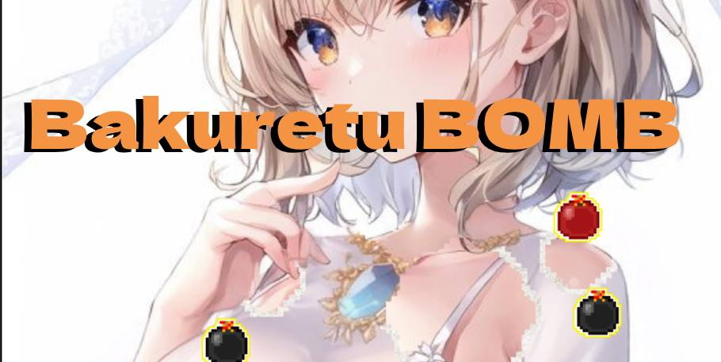

# 爆裂BOMB (Bakuretu Bomb)



落下するボムをクリックして画像の一部を消去するJavaScriptブラウザゲームです。enchant.jsフレームワークを使用したゲームです。

昔流行った「妄撮」をゲーム化できないか考えて作りました。

**↓画像クリックでゲーム開始**

[](https://bakuretuken.github.io/bakuretu-bomb/)

## 概要

爆裂BOMBは、HTML5 Canvasとenchant.jsを使用したシンプルなブラウザゲームです。

落下するボムをクリックまたはタッチして、背景画像の一部を消去していきます。特殊な「爆裂ボム」も登場し、より大きな範囲を消去できます。

## 主な特徴

- PCとスマートフォンに対応
- より大きな範囲を消去する特殊な「爆裂」ボム
- 画像を差し替えるだけで簡単にカスタマイズ可能
- MITライセンスで自由に利用・改造OK

## ゲームメカニクス

- 落下するボムをクリックまたはタッチして背景画像の一部を消去
- 20個に1個の割合で特殊な「爆裂」ボムが出現し、より大きな範囲を消去
- 30秒の制限時間内に5個のボムが同時に落下
- ブロックを消去すると下に隠れた画像が現れる

## サンプル
- [公式サンプル・解説ページ](https://bakuretuken.com/bomb/)

## インストール

1. リポジトリをクローンまたはダウンロード
```bash
git clone https://github.com/yourusername/bomb_js.git
cd bomb_js
```

2. ローカル環境でWEBサーバ起動（ファイルをWebサーバーにアップロード）

3. ブラウザで以下のファイルを開く
   - `index.html` - 無音版
   - `index_sound.html` - 音声付き版

## 使用方法

1. ゲーム開始後、画面上部から落下するボムが表示されます
2. ボムをクリックまたはタッチして消去します
3. 特殊な「爆裂」ボムが出現したら、より大きな範囲を消去できます
4. 制限時間内にできるだけ多くのブロックを消去しましょう

## カスタマイズ

### ゲーム設定

`index.html`ファイル内の以下の変数を変更してゲームをカスタマイズできます：

```javascript
// キャンバスサイズ
var BOMB_GAME_WIDTH  = 540;
var BOMB_GAME_HEIGHT = 800;
// フレームレート
var BOMB_GAME_FPS = 12;
// ゲーム時間（秒）
var BOMB_GAME_LIMIT_TIME = 30;
// タイマーの色指定
var BOMB_GAME_TIMER_LABEL_COLOR = "black";
// 爆裂ボムの出現頻度
var BOMB_GAME_BAKURETU_BOMB_RATE = 20;
// 効果音設定
var BOMB_GAME_BAKURETU_BOMB_SOUND = "off";
```

### 画像カスタマイズ

以下の画像ファイルを置き換えることで、ゲーム画像を変更できます。

- `bomb_game_01.jpg` - ゲーム初期画像
- `bomb_game_02.jpg` - ボム破壊後画像
- `bomb_game_03.jpg` - ボム破壊時の縁画像

## ファイル構成

```
bomb_js/
├── index.html              # ゲームHTML（無音版）
├── index_sound.html        # ゲームHTM+（音声付き）
├── bakuretubomb.js         # ゲームプログラム本体
├── bakuretubomb104.min.js  # ゲームプログラム本体（圧縮版）
├── enchant.min.js          # enchant.jsゲームフレームワーク
├── bomb_sound.mp3          # 音声ファイル
├── bomb_sound.wav          # 音声ファイル
├── bomb_game_01.jpg        # ゲーム初期画像
├── bomb_game_02.jpg        # ボム破壊後画像
├── bomb_game_03.jpg        # ボム破壊時の縁画像
├── bomb_icon_bomb.png      # ボムアイコン画像
├── bomb_icon_menu.png      # メニュー文字画像
└── README.md               # このファイル
```

### ゲームの改造

`index.html`の読み込みJSを`bakuretubomb104.min.js`から下記に変更してください

```
<script src="bakuretubomb.js"></script>
```

`bakuretubomb.js`に対してコーディングを行い変更してください。<br />
`enchant.js`というゲームエンジンを使用しています。

手元のPCでWEBサーバを立ち上げるなどして、サーバ経由で動作確認を行ってください。<br />
ローカルでWEBサーバ起動可能な開発プログラム言語もあります。

```bash
# Python 3の場合
python -m http.server 8000

# Node.jsの場合
npx http-server

# PHPの場合
php -S localhost:8000
```

## 注意事項

- 画像を更新したのに反映されない場合は、ブラウザのキャッシュをクリアしてください

## ライセンス

- 本ゲームプログラム・画像はMITライセンスです。自由にご利用ください
- 使用しているゲームエンジン [enchant.js](https://github.com/wise9/enchant.js/) もMITライセンスです

## クレジット
bakuretuKen 2013

---
@see https://bakuretuken.com/bomb/
