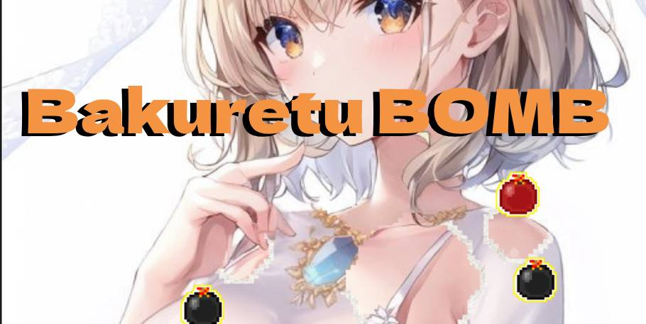
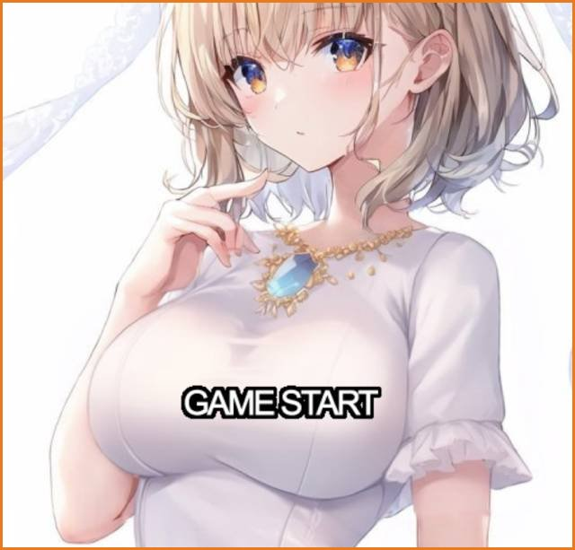
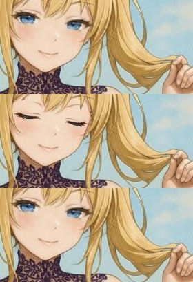

# 爆裂BOMB（Bakuretu BOMB）（TypeScript + Phaser 3版）

[](https://bakuretuken.github.io/bakuretu-bomb/)

落下するボムをクリック（タッチ）して、画像の一部を消去していくブラウザゲームです。

昔流行った「妄撮」をゲーム化できないか考えて作りました。

TypeScript + [Phaser 3](https://phaser.io/) で作成しています。

PC、スマートフォンの両方でゲームが遊べます。<br />
一定の確率で「爆裂ボム」が出現し、通常のボムよりも広い範囲を消去できます。<br />
**画像を削るだけのゲームなので、クリア・ゲームオーバーはありません。**

**↓画像クリックでゲーム開始**

[](https://bakuretuken.github.io/bakuretu-bomb/)

## 概要

- PC・スマートフォン両対応
- 一定確率で出現する「爆裂ボム」は広範囲を消去できる特別仕様
- 画像を差し替えるだけで簡単にカスタマイズ可能
- ポーズボタン・サウンドON/OFFボタン付き
- MITライセンスで自由に利用・改造OK

## 画像を変更して自分のゲームを作る方法

**画像を変更して自分のゲームを作成する場合、distフォルダの中身のみ必要です。**

その他のフォルダは必要ありませんので、削除しても構いません。<br />
distフォルダ以外は開発者向けのファイルやフォルダです。

### ゲームファイル（distフォルダ）

| ファイル名             | 説明                                            |
|------------------------|-------------------------------------------------|
| bomb_game_01.jpg       | ゲーム初期画像（473x700）                       |
| bomb_game_02.jpg       | ボム消去後に現れる画像（473x700）               |
| bomb_game_03.jpg       | ボム消去部分のフチ画像（473x700）               |
| bomb_game_anime.jpg    | アニメーション画像 (*1)                         |
| bomb_icon_bomb.png     | ボム画像（256x64・1コマ64x64の4コマ）           |
| bomb_icon_menu.png     | START画像（256x64）                             |
| bomb_icon_pause.png    | ポーズアイコン画像（96x48・1コマ48x48の2コマ）  |
| bomb_icon_sound.png    | サウンドアイコン画像（122x48・1コマ61x48の2コマ）|
| bomb_sound.wav         | ボム消去音                                      |
| bomb_sound.mp3         | ボム消去音（Internet Explorer用）               |
| index.html             | ゲーム起動用HTML（設定はここで行う）            |
| index_noanime.html     | アニメーション機能を使わないゲーム起動用HTML (*2)|
| bakuretubomb300.js     | ゲームプログラム本体                            |

(*1) アニメーション機能を使用する時のみ必要<br />
(*2) アニメーション機能を使わない場合のみ必要（後述）

ボム画像の4コマは、1〜2コマ目が通常ボムのアニメーション、3〜4コマ目が「爆裂ボム」のアニメーションです。

## 画像について

自分で画像を用意する場合は同じファイル名で、同じ画像サイズでファイルを用意してください。

- `bomb_game_01.jpg` `bomb_game_02.jpg` `bomb_game_03.jpg` `bomb_game_anime.jpg` は JPEG フォーマット
- `bomb_icon_*.png` は PNG フォーマット

3枚のゲーム画像は以下の役割です。すべて同じ画像サイズで用意してください。

| 画像               | 役割                                                       |
|--------------------|------------------------------------------------------------|
| bomb_game_01.jpg   | 最初に表示される画像。ボムを消した部分がこの画像から削られる |
| bomb_game_02.jpg   | 削った部分に現れる画像                                       |
| bomb_game_03.jpg   | 削った部分のフチ（境界）に使われる画像                       |

**ゲーム画像のサイズと、`index.html` で設定するゲーム画面サイズ（`BOMB_GAME_WIDTH` / `BOMB_GAME_HEIGHT`）は同じにしてください。**<br />
サイズが違うと画像が拡大・縮小されて表示されます。

ゲーム画像はレイヤー機能がある画像ソフトでの作成をおすすめします。<br />
サンプル画像の元データ（`bomb_game_03.psd`）をリポジトリに含めています。

**すべての画像の解像度は 72 DPI にしてください。**

# ゲームのカスタマイズ

ゲーム設定は `index.html` 内の変数で行います。

```js
var BOMB_GAME_WIDTH  = 473; // ゲーム画面幅（ゲーム画像の幅と同じにする）
var BOMB_GAME_HEIGHT = 700; // ゲーム画面高さ（ゲーム画像の高さと同じにする）
var BOMB_GAME_FPS = 12; // フレームレート（ボムの落下・アニメーションの速さ）
var BOMB_GAME_BAKURETU_BOMB_RATE = 20; // 爆裂ボムの出現率（1/20の確率で出現）
```

`BOMB_GAME_BAKURETU_BOMB_RATE` は「爆裂ボムの出現率の分母」です。<br />
`20` なら 1/20 の確率で爆裂ボムになります。数値を小さくすると爆裂ボムが出やすくなります。

ボムをクリックすると、通常ボムは十字状の範囲、爆裂ボムはその9倍の範囲（中心＋周囲8か所）を消去します。

## [オプション] アニメーション機能

`dist/index.html` は「アニメーション機能を使用したHTML」です。

アニメーション機能を使用する場合は、HTMLファイル内に以下の変数を追加してください。

```js
・・・省略・・・
var BOMB_GAME_ANIME_IMAGE = 3; // アニメーション画像枚数（アニメ機能利用）
var BOMB_GAME_ANIME_POSITION_X = 172; // アニメーション画像X位置
var BOMB_GAME_ANIME_POSITION_Y = 59; // アニメーション画像Y位置
var BOMB_GAME_ANIME_FRAME = 1; // アニメーション画像切り替えフレーム数
var BOMB_GAME_ANIME_WAIT = 40; // アニメーション待ちフレーム数
```

`BOMB_GAME_ANIME_IMAGE` で「アニメーション画像枚数」を設定することでアニメーション機能を使用できます。

```js
var BOMB_GAME_ANIME_IMAGE = 3;
```

「bomb_game_anime.jpg」画像を用意してください。<br />
画像は「アニメーション画像枚数」分の画像を縦に並べてください。<br />
画像はJPEGフォーマットで用意してください。（縦横の画像サイズは8の倍数を推奨）

**bomb_game_anime.jpg**



アニメーション画像の表示位置を下記で設定します。

```js
var BOMB_GAME_ANIME_POSITION_X = 172;
var BOMB_GAME_ANIME_POSITION_Y = 59;
```

`BOMB_GAME_ANIME_FRAME` で「アニメーションフレーム間隔」を設定することでアニメーション速度を調整できます（フレーム設定）<br />
設定数が大きいほどアニメーション速度が遅くなります。

`BOMB_GAME_ANIME_WAIT` で「アニメーション待ち時間」を設定することでアニメーションの待ち時間を調整できます（フレーム設定）<br />
待ち時間が大きいほどアニメーションとアニメーションの間隔が長くなります。

上記の設定だと、40フレーム経つと3枚のアニメーション画像が1フレーム間隔で表示されます。そして、また40フレームの待ちに入ります。<br />
表示座標位置は (172, 59) です。

【特記事項】<br />
正しい大きさでアニメ画像を作っても表示画像サイズがズレて表示されてしまう場合は、JPEG の DPI の問題の可能性が高いです。すべての JPEG画像の DPI を 72 に設定してください。

## アニメーション機能を使わない場合

アニメーション機能を使わない場合は、アニメーション用の変数を書かない `index_noanime.html` を使用してください。<br />
`index_noanime.html` を `index.html` にリネームすれば、そのままトップページとして公開できます。<br />
この場合、`bomb_game_anime.jpg` は不要です。

（`index.html` からアニメーション用の変数（`BOMB_GAME_ANIME_*`）を削除しても同じ結果になります）

## 自分のパソコンでゲーム実行する

**ゲームを実行するにはWEBサーバ経由で実行する必要があります。**<br />
ホームページを公開している場合は、ホームページ経由でゲームを実行してください。<br />
手元のPCでWEBサーバを立ち上げるなどして、サーバ経由で動作確認も可能です。<br />
自分のパソコンでWEBサーバ起動可能な開発プログラム言語もあります。<br />
dist フォルダで以下のコマンドを実行すると、サーバが起動します。

```bash
# Python 3の場合
python -m http.server 8000

# Node.jsの場合
npx http-server -p 8000

# PHPの場合
php -S localhost:8000
```

## 遊び方

1. スタート画面をクリック（スマートフォンはSTARTボタンをタップ）してゲーム開始
2. 落下してくるボムをクリック・タッチすると、その部分の画像が消去されます
3. 「爆裂ボム」（点滅する色違いのボム）を消すと、より広い範囲を消去できます
4. 画面左下のボタンでポーズ、右下のボタンでサウンドのON/OFFができます
5. 画像を削るだけのゲームなので、クリアはありません。STARTボタンで最初からやり直せます

## 注意事項

- 画像を更新したのに反映されない場合は、ブラウザのキャッシュをクリアしてください（スーパーリロード/強制更新してください。WEBサーバの設定でブラウザキャッシュされているケースもあります）
   - SHIFT + Ctrl + R (Windows)
   - Shift + Command + R (Mac)
- サウンドは初期状態ではOFFです。画面右下のサウンドボタンでONにしてください

## 関連リンク

- [解説WEBページ](https://bakuretuken.com/bomb/)
- [サンプルゲーム](https://bakuretuken.github.io/bakuretu-bomb/)

------------------------------------------------------------

# プログラムを改造するための情報

以降はプログラムを改造するための開発者向け情報になります。

## ファイル構成

| ファイル/フォルダ         | 説明                       |
|---------------------------|----------------------------|
| dist                      | 公開用ビルド成果物（`npm run build` で生成される、本番公開用のファイル一式）|
| src/main.ts               | エントリポイント（Phaser.Game 生成・スケール設定） |
| src/GameScene.ts          | ゲーム本体 ver3.00         |
| src/config.ts             | 設定変数の読み込み・デフォルト値 |
| src/global.d.ts           | HTML側グローバル変数の型定義 |
| index.html                | ゲーム起動用HTML（アニメーション機能あり・設定はここで行う） |
| index_noanime.html        | ゲーム起動用HTML（アニメーション機能なし） |
| public/                   | ゲーム画像・音声（ビルド時に dist へコピーされる） |
| package.json / tsconfig.json / vite.config.ts | TypeScriptプロジェクト設定 |
| bomb_game_03.psd          | サンプルゲーム画像PSD      |

### ゲーム画像・音声（public/ 以下）

| ファイル名             | 説明                                            |
|------------------------|-------------------------------------------------|
| bomb_game_01.jpg       | ゲーム初期画像（473x700）                       |
| bomb_game_02.jpg       | ボム消去後に現れる画像（473x700）               |
| bomb_game_03.jpg       | ボム消去部分のフチ画像（473x700）               |
| bomb_game_anime.jpg    | アニメーション画像 (*1)                         |
| bomb_icon_bomb.png     | ボム画像（256x64・1コマ64x64の4コマ）           |
| bomb_icon_menu.png     | START画像（256x64）                             |
| bomb_icon_pause.png    | ポーズアイコン画像（96x48・1コマ48x48の2コマ）  |
| bomb_icon_sound.png    | サウンドアイコン画像（122x48・1コマ61x48の2コマ）|
| bomb_sound.wav         | ボム消去音                                      |
| bomb_sound.mp3         | ボム消去音（Internet Explorer用）               |

(*1) アニメーション機能を使用する時のみ必要

## セットアップ・使い方

[Node.js](https://nodejs.org/)（v18以上）が必要です。

```bash
# 依存ライブラリのインストール（初回のみ）
npm install

# 開発サーバー起動（http://localhost:5173 でゲームが動作）
npm run dev

# 公開用ビルド（dist/ フォルダに出力）
npm run build
```

- 開発サーバー起動後、以下のURLで各ゲームにアクセスできます
    - `http://localhost:5173/` … アニメーション機能を使用したゲーム
    - `http://localhost:5173/index_noanime.html` … アニメーション機能なしのゲーム
- 公開する場合は `npm run build` で生成された `dist/` フォルダ一式をWebサーバーにアップロードしてください
- 画像を差し替える場合は、`public/` 内の画像を同じファイル名・サイズで用意してください
- `npm run build` は `tsc --noEmit` による型チェックを行ってからビルドします

## ゲームプログラムの改造

ゲーム本体は `src/` フォルダの TypeScript プログラムです。改造する場合は `src/GameScene.ts` を編集してください。

| ファイル          | 内容                                       |
|-------------------|--------------------------------------------|
| src/main.ts       | エントリポイント（Phaser.Game 生成・スマホ判定とスケール設定） |
| src/GameScene.ts  | ゲーム本体（ボムの落下・画像消去処理・アニメーション） |
| src/config.ts     | index.html の設定変数の読み込み            |
| src/global.d.ts   | 設定変数の型定義                            |

ゲームエンジンには [Phaser 3](https://phaser.io/) を使用しています。

動作確認は開発サーバーで行います。

```bash
npm run dev
```

### 画像消去のしくみ

Phaser の CanvasTexture 2枚（表示用・バッファ用）を使って、enchant.js 版の Surface 処理をそのまま移植しています。

1. 表示用キャンバスに初期画像（`bomb_game_01.jpg`）、バッファにフチ画像（`bomb_game_03.jpg`）を描画
2. ボムがクリックされた位置に、バッファ上へ消去後画像（`bomb_game_02.jpg`）を段階的に描画（`clearBlock()`）
3. バッファの該当領域を少し大きめに表示用キャンバスへ転送することで、消去部分の外周にフチ画像が残る

爆裂ボムは `clearBlockBig()` で中心＋周囲8か所の `clearBlock()` を呼び出し、広範囲を消去します。

### 主な定数・ゲーム状態

| 定義 | 場所 | 説明 |
|------|------|------|
| `BOMB_COUNT` | src/GameScene.ts | 同時に落下するボムの数（既定 5） |
| `mode` | src/GameScene.ts | ゲーム状態。`0`: ゲーム開始待ち、`1`: プレイ中 |
| `isPause` / `isSound` | src/GameScene.ts | ポーズ状態・サウンドON/OFF状態 |

ボムの落下速度は `BombSprite.init()` 内でボムごとにランダム（`rand(18) + 6`）に決まります。

### ビルド出力について

`index.html` と `index_noanime.html` の2つのHTMLが同じ `src/main.ts` を共有するため、実体のJSはエントリチャンクではなく共有チャンク `bakuretubomb300.js` として出力されます（`vite.config.ts` で設定）。

## 過去バージョン（enchant.js版）

- ver3.00 から TypeScript + Phaser 3 に書き換えました。（以前は JavaScript + enchant.js で作成）
- enchant.js 版（ver2.01）は下記のページからダウンロードできます。

**enchantjs-version**<br />
[https://github.com/BakuretuKen/Bakuretu-Bomb/releases/tag/enchantjs-version](https://github.com/BakuretuKen/Bakuretu-Bomb/releases/tag/enchantjs-version)

## ライセンス

- 本ゲームプログラム・画像はMITライセンスです。自由にご利用ください。自由に改造してください。
- 使用しているゲームエンジン [Phaser 3](https://github.com/phaserjs/phaser) もMITライセンスです

---

bakuretuKen 2013-2026<br />
@see https://bakuretuken.com/bomb/
